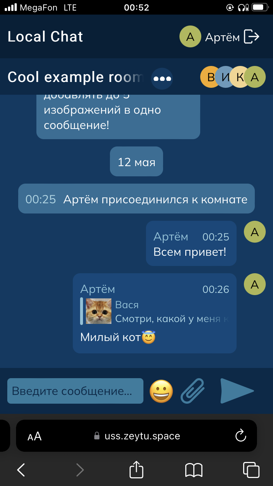

# Локальный чат в браузере


> https://uss.zeytu.space

Данный чат работает в браузере. Сессия работает в пределах одной вкладки. 

Вся информация хранится исключительно в бразуере, переписываться можно только между вкладками. 

## Функции 

* Отправка сообщений
* Возможность **отвечать** на сообщение (правая кнопка мыши или двойной клик по сообщению)
* Возможность отправлять **до 5 изображений** в сообщении
* Возможность отпавлять **эмодзи**

## Хранилище 

Для хранения данных сессии используется `sessionStorage`.

Для хранения информации о чатах, пользователях и сообщений используется `localStorage`.

Для изображений используется `IndexedDB`.

## Развёртывание 

### Dev

Для развёртывания проекта в dev режиме необходимо выполнить следующие команды:

```shell
npm install
npm run start
```


### Production 

Для сборки production версии сайта нужно выполнить команды:

```shell
npm install
npm run build
```

После этого необходимо настроить любой сервер для раздачи статичных файлов из директории `build` (к примеру, [Nginx](https://nginx.org/en/)).
